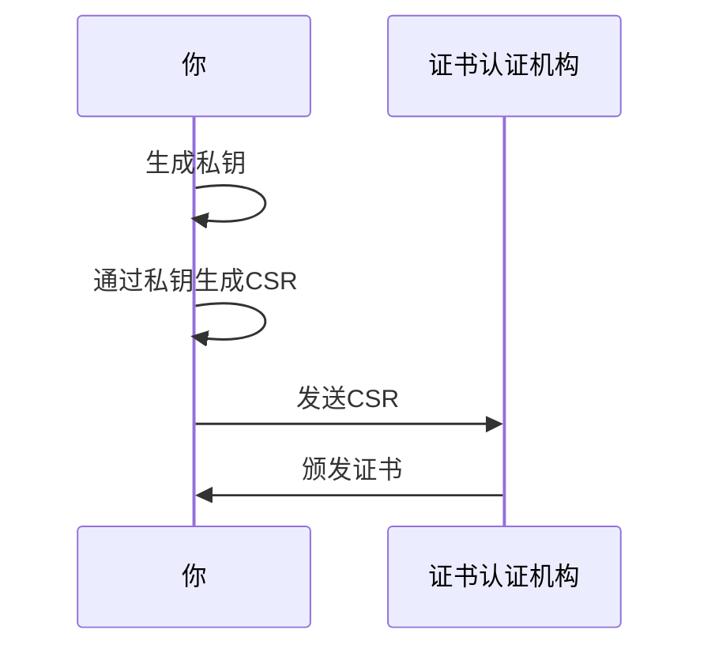

# 如何启动一个https服务器

>  一直对https的原理、证书、私钥公钥这些东西的逻辑没有理清楚，今天借着解决一个https的混合内容的问题一举将它们拿下

要想启动一个https的服务，我们首先需要一个私钥文件和一个证书

## 如何获得私钥和证书

通过 openssl 库生成，这个库就是整个互联网安全的根基

首先我们需要安装 openssl ，使用 windows 安装和生成的时候经常会碰到一些意外，所以我用的是WSL——Ubuntu自带 openssl ，直接运行即可 

```shell
＃生成私钥key文件
openssl genrsa 1024 > /path/to/mydomain.key

＃通过私钥文件生成CSR
openssl req -new -key /path/to/mydomain.key -out mydomain.csr

＃通过私钥文件和CSR生成证书文件（使用自己的私钥进行签名生成证书）
openssl x509 -req -days 365 -in csr.pem -signkey /path/to/mydomain.key -out /path/to/mydomain.crt
```

> 可以在 [这个地方](https://www.digicert.com/kb/ssl-support/openssl-quick-reference-guide.htm) 参考查看部分命令的详细说明

上面命令总共生成了三个文件

1. 私钥
2. CSR（Certificate Signing Request）
3. 证书

私钥和证书文件都比较容易理解，但是CSR是个什么玩意儿？

简单的说，就是一个签着你自己名的申请书，专门用来申请证书用的

一般情况下的证书申请涉及两个角色：你和CA（证书认证机构）

申请流程如下



>  私钥文件包含公钥和私钥，可以通过命令提取公钥
>
> CSR包含公钥以及用户的信息——比如域名、区域名称等等

## CA服务商做了什么

CA服务商拿到用户的CSR之后，会使用自己的私钥对用户的CSR进行签名，然后生成证书颁发给用户

这里是不是有点绕，没错，CA服务商自己也会使用前面的操作生成私钥和证书，这个自颁发的证书就是一般意义上受信任的根证书

而颁发给用户的证书，可以通过已经安装的CA服务商的证书（包含公钥）进行解密，从而得出该证书是被CA认证过的有效证书

如果使用用户的私钥给别人的CSR做签名颁发证书，这样套娃一样层层认证就是**证书链**

## 一个https服务器

使用express实现如下

```JS
const fs = require("fs");
const https = require("https");
const express = require("express");
const app = express();
const port = 3002;

const options = {
  // 我们生成的私钥
  key: fs.readFileSync("./cert/mydomain.key"),
  // 我们获取的证书
  cert: fs.readFileSync("./cert/mydomain.crt"),
};

https
  .createServer(options, app)
  .listen(port, () => console.log(`App listening on port ${PORT}!`));

app.get("/", (req, res) => {
  res.send("Hello World!");
});
```


但是，运行以后我们访问3002端口会返回不安全的提示——因为我们用的证书是自己颁发给自己的，chrome并不相信它，并给出了证书无效的提示

如果是从CA服务商获取的证书就不会发生这种情况，但是我们也可以通过手动将这个证书添加到受信任的根证书颁发机构来解决这个问题

## https请求有什么不一样

借用一张网图，清晰明了，相比http，https多了证书认证和加解密的操作


## 可以进一步探究的问题

* 为什么是RSA，为什么CA会要求至少使用2048位长度的RSA
* 什么是中间人攻击，怎么实施一次中间人攻击
* whistle等抓包工具的实现原理

以上，如有谬误请指正

